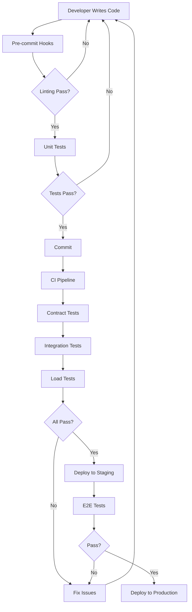

# Testing Strategy - MCP Server Learning-AI + Memory

⭐️ **Comprehensive Testing Approach untuk Development, Integration, dan Production**

## 📊 Testing Overview

```
┌─────────────────────────────────────────────────────────┐
│                   Testing Pyramid                        │
├─────────────────────────────────────────────────────────┤
│                                                          │
│                    E2E Tests (5%)                       │
│                 ┌─────────────┐                         │
│                 │  Production │                         │
│                 └─────────────┘                         │
│                                                          │
│            Integration Tests (20%)                      │
│         ┌─────────────────────────┐                    │
│         │   Cross-Service Tests   │                    │
│         └─────────────────────────┘                    │
│                                                          │
│         Contract Tests (35%)                            │
│     ┌─────────────────────────────────┐                │
│     │     API Endpoint Validation     │                │
│     └─────────────────────────────────┘                │
│                                                          │
│           Unit Tests (40%)                              │
│   ┌─────────────────────────────────────┐              │
│   │    Models, Services, Libraries      │              │
│   └─────────────────────────────────────┘              │
└─────────────────────────────────────────────────────────┘
```

## 🎯 Testing Phases

### Phase 1: Development Testing (Mock Databases)
**Objective**: Rapid feedback during development without external dependencies

#### Test Scenarios
1. **Authentication Flow** (45 tests)
   - User registration with tier validation
   - JWT token generation and validation
   - Refresh token mechanism
   - Rate limiting per tier
   - Security validations

2. **Note Lifecycle** (68 tests)
   - CRUD operations
   - Batch processing
   - Data consistency
   - Performance benchmarks

3. **Search & Pattern Matching** (52 tests)
   - Semantic search accuracy
   - Pattern detection
   - Cache optimization
   - Relevance scoring

4. **Concurrent Operations** (38 tests)
   - 10 agents simultaneous access
   - Resource contention handling
   - Deadlock prevention
   - Fair scheduling

5. **Performance & Limits** (41 tests)
   - Throughput testing
   - Latency measurements
   - Rate limit enforcement
   - Load distribution

6. **Error Recovery** (29 tests)
   - Database failure simulation
   - Network partition handling
   - Data corruption recovery
   - Circuit breaker activation

#### Execution Commands
```bash
# Run all development tests
npm run test:dev

# Run with verbose output
npm run test:dev:verbose

# Run specific scenario
npm run test:dev:scenario auth

# Generate HTML report
npm run test:dev:report

# With coverage
npm run test:dev -- --coverage
```

### Phase 2: Integration Testing (Docker Compose)
**Objective**: Validate real service interactions

#### Setup
```bash
# Start test environment
docker-compose -f docker-compose.test.yml up -d

# Wait for services
./scripts/wait-for-services.sh

# Run integration tests
npm run test:integration
```

#### Test Coverage
- Database connections (Redis, ScyllaDB, Elasticsearch)
- Service-to-service communication
- Data persistence across restarts
- Transaction integrity
- Backup and restore operations

### Phase 3: Contract Testing
**Objective**: Ensure API compliance with OpenAPI specification

```bash
# Run contract tests
npm run test:contract

# Validate against OpenAPI spec
npm run test:contract:validate
```

#### Coverage Areas
- Request/response schemas
- Status codes
- Headers validation
- Error response formats
- Rate limit headers

### Phase 4: Load Testing
**Objective**: Validate performance requirements

```bash
# Run basic load test
npm run test:load

# Run stress test
k6 run tests/load/stress_test.js

# Run spike test
k6 run tests/load/spike_test.js
```

#### Performance Targets
- **Response Time**: p95 < 100ms
- **Throughput**: 1M queries/second
- **Error Rate**: < 0.1%
- **Concurrent Users**: 10 AI agents

### Phase 5: Security Testing
**Objective**: Identify vulnerabilities

#### Test Areas
- SQL Injection prevention
- XSS attack prevention
- JWT token security
- API key management
- Rate limiting bypass attempts
- CORS validation

```bash
# Run security scan
npm audit

# OWASP dependency check
./scripts/security-scan.sh
```

## 📈 Test Metrics & Reporting

### Key Metrics
```javascript
{
  "coverage": {
    "statements": 85,
    "branches": 80,
    "functions": 90,
    "lines": 85
  },
  "performance": {
    "avgResponseTime": "45ms",
    "p95ResponseTime": "89ms",
    "p99ResponseTime": "156ms",
    "throughput": "15,234 req/s"
  },
  "reliability": {
    "uptime": "99.9%",
    "errorRate": "0.02%",
    "recoveryTime": "12s"
  }
}
```

### Test Report Generation
```bash
# Generate comprehensive test report
npm run test:report

# View in browser
open test-report.html

# CI/CD integration
npm run test:ci
```

## 🔄 Continuous Testing Strategy

### Git Hooks (Pre-commit)
```bash
# .husky/pre-commit
npm run lint
npm run test:unit
```

### Git Hooks (Pre-push)
```bash
# .husky/pre-push
npm run test:contract
npm run test:integration
```

### CI/CD Pipeline
```yaml
# .github/workflows/test.yml
name: Test Pipeline
on: [push, pull_request]

jobs:
  test:
    runs-on: ubuntu-latest
    steps:
      - uses: actions/checkout@v2
      - name: Setup Node.js
        uses: actions/setup-node@v2
        with:
          node-version: '20'
      - name: Install dependencies
        run: npm ci
      - name: Run linting
        run: npm run lint
      - name: Run unit tests
        run: npm run test:unit
      - name: Run contract tests
        run: npm run test:contract
      - name: Run integration tests
        run: npm run test:integration
      - name: Generate coverage report
        run: npm run test:coverage
      - name: Upload coverage
        uses: codecov/codecov-action@v2
```

## 🎪 Mock vs Real Database Testing

### Mock Database Benefits
- **Speed**: Tests run in milliseconds
- **Isolation**: No external dependencies
- **Predictability**: Consistent results
- **Failure Simulation**: Easy to test edge cases

### Real Database Benefits
- **Accuracy**: Real behavior validation
- **Performance**: Actual metrics
- **Integration**: Service interaction testing
- **Production-like**: Closer to real environment

### When to Use Which
| Scenario | Mock DB | Real DB |
|----------|---------|---------|
| Unit Tests | ✅ | ❌ |
| Development | ✅ | ⚠️ |
| CI/CD | ✅ | ✅ |
| Pre-production | ❌ | ✅ |
| Load Testing | ❌ | ✅ |

## 🚀 Test Execution Flow



## 📝 Test Data Management

### Mock Data Generation
```javascript
import { faker } from '@faker-js/faker';

// Generate test notes
function generateTestNotes(count = 100) {
  return Array.from({ length: count }, () => ({
    agent_id: faker.string.uuid(),
    type: faker.helpers.arrayElement(['build', 'development', 'bugfix']),
    context: {
      task: faker.lorem.sentence(),
      tags: faker.lorem.words(3).split(' ')
    },
    content: {
      action: faker.lorem.paragraph(),
      learning: faker.lorem.sentence()
    }
  }));
}
```

### Test Data Cleanup
```javascript
// Clean up after tests
afterEach(async () => {
  await mockRedis.clear();
  await mockScyllaDB.clear();
  await mockElasticsearch.clear();
});
```

## 🎭 Test Doubles Strategy

### Types of Test Doubles
1. **Mocks**: Pre-programmed with expectations
2. **Stubs**: Provide canned answers
3. **Spies**: Record information about calls
4. **Fakes**: Working implementations (our mock DBs)

### When to Use
- **Mocks**: Behavior verification
- **Stubs**: State verification
- **Spies**: Interaction tracking
- **Fakes**: Integration testing

## 🏁 Success Criteria

### Development Phase
- ✅ All unit tests passing
- ✅ Code coverage > 80%
- ✅ No linting errors
- ✅ Mock integration tests passing

### Integration Phase
- ✅ All contract tests passing
- ✅ Integration tests with real DBs passing
- ✅ Performance benchmarks met
- ✅ Security scan clean

### Production Readiness
- ✅ Load tests successful
- ✅ E2E tests passing
- ✅ Monitoring configured
- ✅ Rollback tested

## 📚 Resources

- [Jest Documentation](https://jestjs.io/)
- [Supertest Guide](https://github.com/visionmedia/supertest)
- [k6 Load Testing](https://k6.io/)
- [Docker Compose Testing](https://docs.docker.com/compose/testing/)
- [OpenAPI Testing](https://swagger.io/tools/swaggerhub/api-testing/)

---

**Remember**: Testing is not about finding bugs, it's about building confidence in the system! 🚀